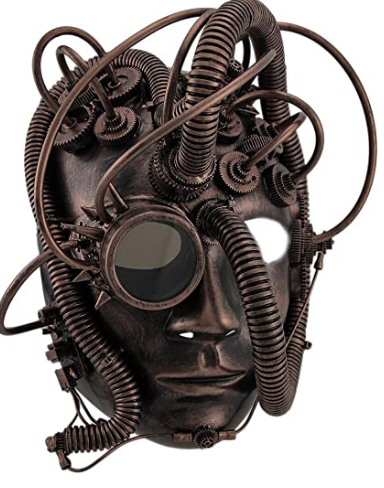

# Mandroid

## Description

A humanoid talking robot head.

The head listens to you with a microphone, formulates a response, and then replies using speech synthesis while moving its mouth.

Currently, I have PWM working on the beaglebone and a rudimentary speech synthesizer as well as speech recognition.

The primitive chat-bot, the mouth, and servo control are not working.

An example of a much more complex version of what I'm aiming for can be found [here](https://www.youtube.com/watch?v=WN9IdpB2-oo). At a minimum, this robot will respond to some speech input, move its mouth a bit, and output some speech output. If I can't build a complex chat bot in time, that's okay with me. I plan to focus on the other three parts more than anything else.

## Installation

Requires microphone and speaker.

Install libpython3.7, libsdl2-dev, libsdl2-mixer-dev, python3-audio, flac, and pybind11-dev

Use pip to install the Python `SpeechRecognition` library.

Then run `make` and `sudo make install`
