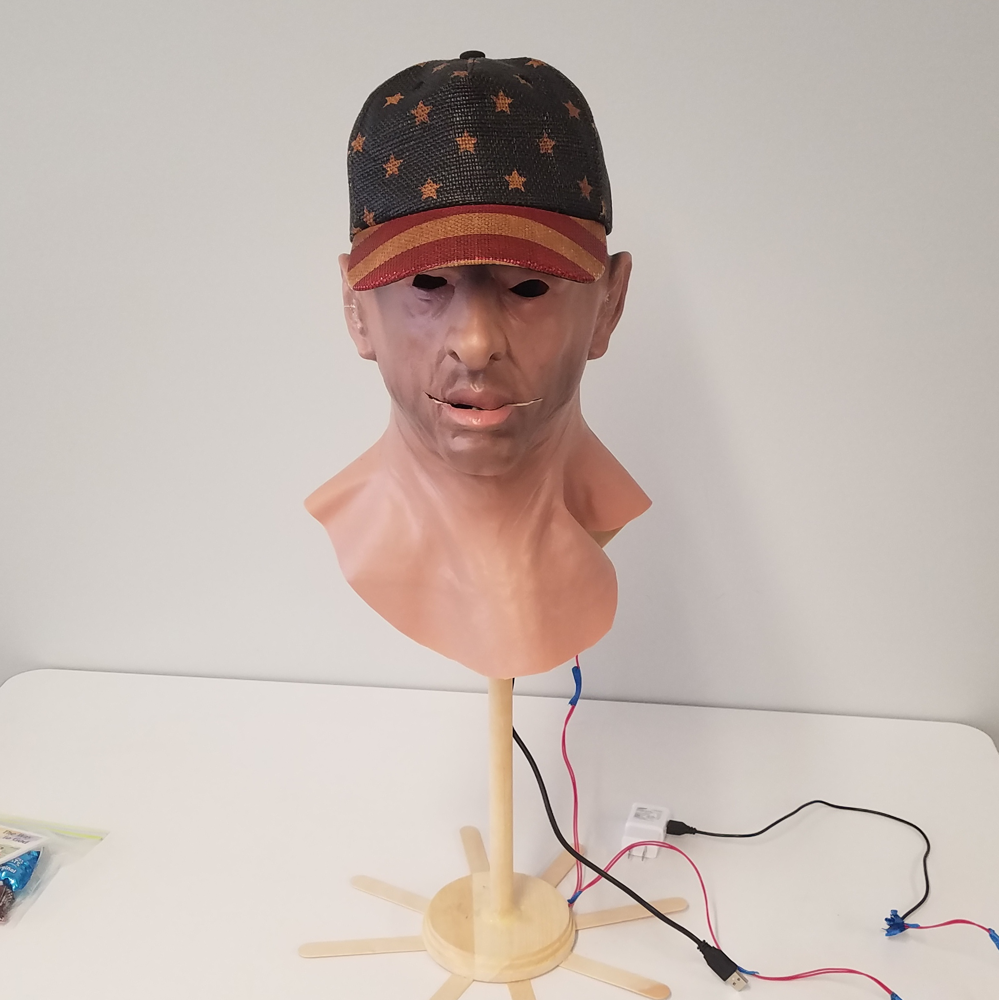

# Mandroid



## Description

A humanoid talking robot head.

The head listens to you with a microphone, formulates a response, and then replies using speech synthesis while moving its mouth.

Currently, I have PWM working on the beaglebone and a rudimentary speech synthesizer as well as speech recognition.

The primitive chat-bot, the mouth, and servo control are not working.

An example of a much more complex version of what I'm aiming for can be found [here](https://www.youtube.com/watch?v=WN9IdpB2-oo). At a minimum, this robot will respond to some speech input, move its mouth a bit, and output some speech output. If I can't build a complex chat bot in time, that's okay with me. I plan to focus on the other three parts more than anything else.

## Installation

```
sudo apt install -y libsdl2-dev libsdl2-mixer-dev python3-pyaudio pybind11-dev flac
pip3 install PyAudio
pip3 install SpeechRecognition
git clone https://github.com/blueOkiris/python-duckduckgo
cd python-duckduckgo
sudo python3 setup.py install
cd ..
git clone https://github.com/blueOkiris/man-droid
cd man-droid
make
sudo make install
```

Here's the explanation:

- Install Dependencies:

  * SDL2_mixer is required for speech synthesis: `libsdl2-dev libsdl2-mixer-dev`

  * The Python pip libraries `PyAudio` and `SpeechRecognition` is required for speech recognition. It relies on: `python3-pyaudio`

  * The python speech recognition library is called in C++ using pybind: `pybind11-dev`

  * Flac for audio input

  * python-duckduckgo

    * Download custom duckduckgo library (for search)

    * Go into the directory

    * Install it

    * Leave the directory

 - Download main project from git

 - Go into the project folder

 - Build it with make

 -Install system service for running at start
